# aihaus 3.0 — Architecture

How the pieces fit together: **workflows → their gate hooks → their agents → the agents' lifecycle hooks → the agents' skills.** aihaus 3.0 is specialist agents running *inside* gated workflows, with local memory — layered on Claude Code's native primitives.

> Wiring verified against the package on `main`: stages from `pkg/.aihaus/protocols/default.md`, hook → event from `pkg/.aihaus/templates/settings.local.json`, stage owners from `pkg/.aihaus/protocols/agents.md`, and sub-flow → specialist spawns from the `aih-plan` / `aih-feature` / `aih-bugfix` skills.

## The map

```mermaid
flowchart TB
  classDef skill fill:#3d2a5c,stroke:#a06cd9,color:#fff,stroke-width:2px
  classDef stage fill:#1e3a5f,stroke:#4a90d9,color:#fff
  classDef hook fill:#5c1a1a,stroke:#e06c6c,color:#fff
  classDef wf fill:#1a4d2e,stroke:#4caf72,color:#fff
  classDef spec fill:#5c4a1a,stroke:#d9b34a,color:#fff
  classDef mem fill:#14403a,stroke:#3fa796,color:#fff

  REQ(["Natural-language request"]):::skill
  GOAL(["native /goal — autonomous loop"]):::skill
  REQ -->|auto-route by description| RT{"classify intent"}
  GOAL -.wraps a run.-> RT
  RT --> KPLAN & KFEAT & KBUG

  subgraph ACT["Sub-flows = the actions (skills)"]
    KPLAN(["/aih-plan"]):::skill
    KFEAT(["/aih-feature"]):::skill
    KBUG(["/aih-bugfix"]):::skill
  end

  subgraph KB["Stage workflow · local kanban (kanban.db)"]
    direction TB
    B["backlog"]:::stage --> EN["entendimento"]:::stage --> PL["planejamento"]:::stage --> TD["tdd"]:::stage --> RX["review-execucao"]:::stage --> TS["testes"]:::stage --> HO["homolog 🔒 online"]:::stage --> HR["human-review"]:::stage --> PD["prod 🔒 online"]:::stage --> BX["box-dev"]:::stage
  end
  KPLAN -.drives.-> PL
  KFEAT -.drives.-> TD
  KBUG  -.drives.-> TD

  subgraph WFA["Workflow agents · stage owners"]
    WI["workflow-intake"]:::wf
    WP["workflow-planning-gate"]:::wf
    WT["workflow-tdd-gate"]:::wf
    WE["workflow-execution-review"]:::wf
    WG["workflow-test-gate"]:::wf
    WC["workflow-cicd"]:::wf
    WD["workflow-dev-reviewer"]:::wf
    WH["workflow-human-review"]:::wf
  end
  WI --- B
  WP --- PL
  WT --- TD
  WE --- RX
  WG --- TS
  WC --- HO
  WC --- PD
  WD --- HO
  WH --- HR

  GTDD[["tdd-guard.sh · PreToolUse"]]:::hook -->|gate| TD
  GFLOW[["flow-guard.sh · PreToolUse<br/>online boundary"]]:::hook -->|flow-gated| HO
  GFLOW -->|flow-gated| PD
  GSTOP[["autonomy-guard.sh · Stop"]]:::hook -->|no bad pause| KB

  subgraph SP["Specialist agents (spawned by sub-flows)"]
    direction TB
    AAN["assumptions-analyzer"]:::spec
    PMA["pattern-mapper"]:::spec
    PCH["plan-checker"]:::spec
    IMP["implementer ⌖wt"]:::spec
    FED["frontend-dev ⌖wt"]:::spec
    CFX["code-fixer ⌖wt"]:::spec
    CRV["code-reviewer"]:::spec
    VRF["verifier"]:::spec
    ICK["integration-checker"]:::spec
    DBG["debugger"]:::spec
    TWR["test-writer"]:::spec
  end
  KPLAN --> AAN & PMA & PCH
  KFEAT --> IMP & FED & CRV & CFX & VRF & ICK
  KBUG  --> DBG & TWR & CRV & CFX

  subgraph AL["Agent-lifecycle hooks"]
    LST[["SubagentStart →<br/>context-inject.sh · audit-agent.sh"]]:::hook
    LSP[["SubagentStop →<br/>worktree-release.sh · learning-advisor.sh<br/>warning-recurrence.sh"]]:::hook
    LPT[["PreToolUse →<br/>flow · tdd · git-add · file · bash · read-guard"]]:::hook
    MB[["merge-back.sh<br/>(flow-invoked: per-file Owned-Files)"]]:::hook
  end
  LST -.injects context.-> SP
  LPT -.guards every tool call.-> SP
  IMP & FED & CFX -.isolated worktree.-> LSP
  IMP & FED & CFX -.disjoint files.-> MB

  subgraph MM["Local memory · never hosted"]
    MDX["project.md · decisions.md<br/>knowledge.md · environment.md"]:::mem
    AGR["aih-graph · SQLite + BM25/FTS5"]:::mem
  end
  MDX -.@import each session.-> LST
  AGR -.aihaus memory --json.-> SP
  GRF[["aih-graph-refresh.sh<br/>SessionStart · TaskCompleted · SessionEnd"]]:::hook -.refresh.-> AGR
```

**Legend:** 🟪 skills / sub-flows · 🟦 kanban stages (🔒 = flow-gated online) · 🟩 `workflow-*` agents · 🟨 specialist agents (`⌖wt` = `isolation: worktree`) · 🟥 hooks (event in label) · 🟢 local memory.

## Hook → Claude Code event

Every hook is wired in `pkg/.aihaus/templates/settings.local.json`.

| Event | aihaus hooks |
|-------|--------------|
| `SessionStart` | `aih-graph-refresh` · `project-context-refresh` · `session-start` |
| `UserPromptExpansion` | `calibrate-guard` |
| `PreToolUse` | **`flow-guard`** · **`tdd-guard`** · `git-add-guard` · `bash-guard` · `file-guard` · `read-guard` |
| `PostToolUse` | `aih-graph-stale` · `audit-log` · `backup-file` |
| `SubagentStart` | **`context-inject`** · `audit-agent` |
| `SubagentStop` | `worktree-release` · `learning-advisor` · `warning-recurrence` |
| `Stop` | **`autonomy-guard`** |
| `TaskCreated` / `TaskCompleted` | `task-created` / `task-completed` (+ `aih-graph-refresh` + `project-context-refresh`) |
| `SessionEnd` | `session-end` · `worktree-release-all` · `aih-graph-refresh` · `project-context-refresh` |
| `TeammateIdle` | `teammate-idle` |

`merge-back.sh` is **flow-invoked** (per-file Owned-Files merge during worktree merge-back), not wired to a lifecycle event.

## Stage → owner → gate

| Stage | Owner (`workflow-*` agent) | Gate / enforcing hook |
|-------|----------------------------|------------------------|
| `backlog` | `workflow-intake` | clear title + intent |
| `entendimento` | *(interactive sub-flow scoping)* | 100% understanding (BR-1) |
| `planejamento` | `workflow-planning-gate` | business rules + testable criteria; `calibrate-guard` |
| `tdd` | `workflow-tdd-gate` | failing tests first — **`tdd-guard.sh`** |
| `review-execucao` | `workflow-execution-review` | worktree build + local Playwright smoke |
| `testes` | `workflow-test-gate` · `workflow-cicd` | full suite in local Docker |
| `homolog` 🔒 | `workflow-dev-reviewer` · `workflow-cicd` | staging + Playwright — **`flow-guard.sh` (flow-gated)** |
| `human-review` | `workflow-human-review` | human accepts or sends back |
| `prod` 🔒 | `workflow-cicd` | production — **`flow-guard.sh` (flow-gated)** |
| `box-dev` | — | project-specific |

`autonomy-guard.sh` (`Stop`) spans the whole execution — it blocks bad pauses at decomposition seams.

## Sub-flow → specialist agents

`⌖` = `isolation: worktree`; `*` = conditional.

| Sub-flow | Spawns |
|----------|--------|
| `/aih-plan` *(read-only)* | `assumptions-analyzer` · `pattern-mapper` · `phase-researcher`* · `plan-checker` · `plan-calibrator`* |
| `/aih-feature` | `implementer`⌖ · `frontend-dev`⌖ · `code-reviewer` · `code-fixer`⌖ · `verifier` · `integration-checker` · `migration-reviewer`* |
| `/aih-bugfix` | `debugger` · `test-writer` · `code-reviewer` · `code-fixer`⌖ |

*(Shown are the agents the sub-flows actually spawn; the package ships 59 specialist agents in total.)*

## The parallelism invariant (ADR-260529-A)

File writes by parallel agents are safe **iff all five hold**: (1) isolated worktree, (2) disjoint Owned-Files, (3) sequential merge-back, (4) single-writer DB, (5) `autonomy-guard` drift catch. Two agents never edit the same file — parallelism comes from sharding work into disjoint file sets. Full contract: [`pkg/.aihaus/protocols/parallelism.md`](../pkg/.aihaus/protocols/parallelism.md).
